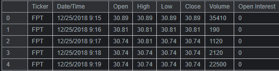
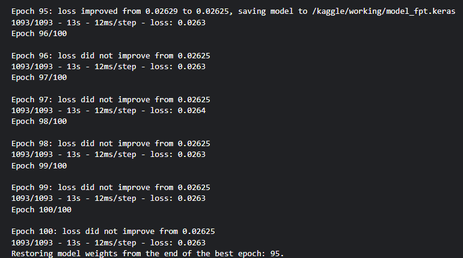
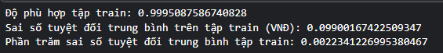
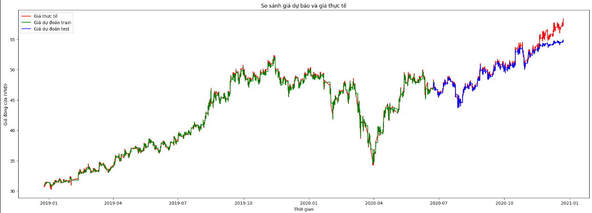

# Predicting-Stock-Prices-Using-LSTM
# 📈 Stock Price Prediction using LSTM

## 🚀 Giới thiệu
Dự án dự đoán giá cổ phiếu sử dụng mạng **LSTM (Long Short-Term Memory)** theo timeseries của một vài công ty lớn ở Việt Nam như FPT,Vinalmilk...
Mục tiêu: dự đoán giá đóng cửa (`Close`) trong những ngày tiếp theo dựa vào dữ liệu lịch sử.

---

## 📊 Dataset
- Nguồn: [Kaggle Dataset](https://www.kaggle.com/code/huynguyen221/predicting-stock-prices-using-lstm)
- Bao gồm các cột: `Ticker，Date/Time，	Open，	High，	Low，	Close，	Volume，	Open Interest`
- 
> ⚠️ Repo này chỉ chứa dữ liệu mẫu `fpt.csv` thay nó bằng dữ liệu thực tế vào thư mục data/.
## 📈 Result
- Loss
- 
- Score Train và test
- 
- 
- Predict và actual
- 
---

## ⚙️ Công nghệ
- Python 3.10+
- TensorFlow / Keras
- Pandas, NumPy, Scikit-learn
- Matplotlib, Seaborn

---

## 🔧 Cách chạy
```bash
git clone https://github.com/<username>/Predicting-Stock-Prices-Using-LSTM.git
cd stock-price-prediction-lstm
pip install -r requirements.txt

# Train model
python src/train.py

# Evaluate model
python src/evaluate.py
